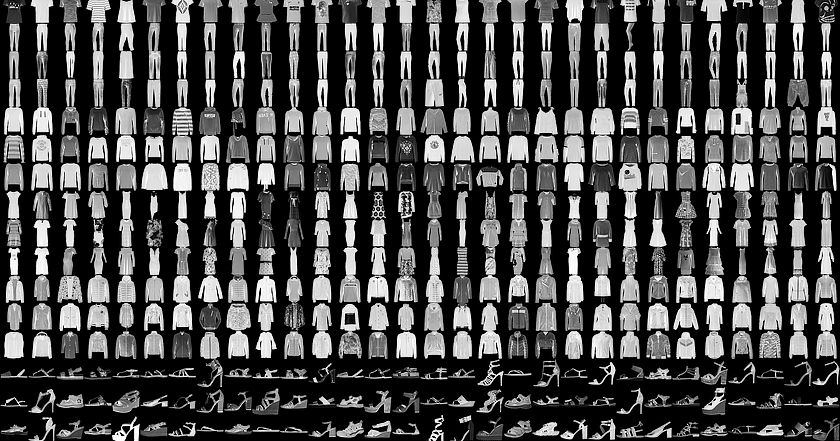

# Convolutional neural network for image classification 

In this notebook, I train a simple convolutional neural network (CNN) in PyTorch to classify images using Zalando's [Fashion-MNIST dataset](https://github.com/zalandoresearch/fashion-mnist). From their description:

*Fashion-MNIST is a dataset of Zalando’s article images consisting of a training set of 60,000 examples and a test set of 10,000 examples. Each example is a 28×28 grayscale image [of a piece of clothing], associated with a label from 10 classes. Fashion-MNIST is intended to serve as a direct drop-in replacement of the original MNIST dataset for benchmarking machine learning algorithms.*

These images look like this: 

 
 
The images in this dataset are small and regular and the classes are balanced, so you don't need to spend much time worrying about data preprocessing or metrics and and can focus on the neural network itself.

I'm training a simple neural network consisting of two convolutional layers with two pooling layers followed by three fully connected layers. This network achieves a prediction accuracy of 90% on the test set. It does have some trouble however with distinguishing between two very similar classes: Shirts and t-shirts. 

I originally wrote this notebook for myself as as reference for future projects with PyTorch. If you're looking for detailed explanations on how convolutional neural networks work and tutorials on how to implement them in PyTorch, see: 
* [How Convolutional Neural Networks Work](https://www.youtube.com/watch?v=FmpDIaiMIeA) by Brandon Rohrer on YouTube
* Official PyTorch tutorial for CNNs: [60 Minute Blitz > Training a Classifier](https://pytorch.org/tutorials/beginner/blitz/cifar10_tutorial.html#sphx-glr-beginner-blitz-cifar10-tutorial-py) 
* [Detailed introduction to CNNs and their implementation in PyTorch](https://adventuresinmachinelearning.com/convolutional-neural-networks-tutorial-in-pytorch/) using the similar MNIST dataset from www.adventuresinmachinelearning.com

Convolutional neural network for image classification using the FashionMNIST dataset
